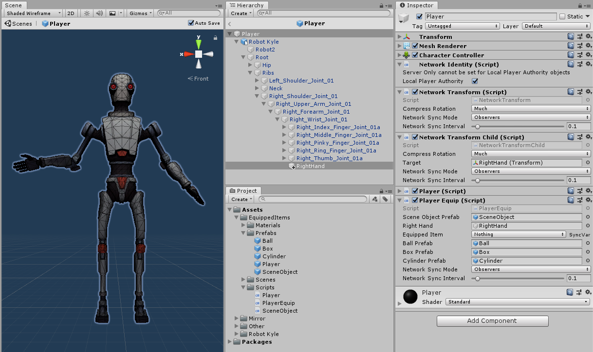

# Child Objects

Frequently the question comes up about how to handle objects that are attached as children of the player prefab that all clients need to know about and synchronize, such as which weapon is equipped, picking up networked scene objects, and players dropping objects into the scene.

Mirror cannot support multiple Network Identity components within an object hierarchy. Since the Player object must have a Network Identity, none of its descendant objects can have one.

Let's start with the simple case of a single attachment point, called `RightHand`, that is somewhere down the hierarchy of our Player, likely at the end of an arm. In a script that inherits from NetworkBehaviour on the Player Prefab, we'd have a SyncVar enum with various choices of what the player is holding, and a `GameObject` reference where `RightHand` can be assigned in the inspector, and a Hook for the SyncVar to swap out the art of the held item based on the new value.

In the image below, I've created a simple player capsule with an arm and hand, and I've made some prefabs to be equiipped (Ball, Box, Cylinder) and a Player Equip script to handle them.



Here's the Player Equip script to handle the changing of the equipped item:

```
using UnityEngine;
using Mirror;

public class PlayerEquip : NetworkBehaviour
{
    public enum EquippedItem : byte
    {
        nothing,
        ball,
        box,
        cylinder
    }

    public GameObject rightHand;

    [SyncVar(hook = nameof(OnChangeEquipment))]
    public EquippedItem equippedItem;

    public GameObject ballPrefab;
    public GameObject boxPrefab;
    public GameObject cylinderPrefab;

    void OnChangeEquipment(EquippedItem newEquippedItem)
    {
        while (rightHand.transform.childCount > 0)
            DestroyImmediate(rightHand.transform.GetChild(0).gameObject);

        switch (newEquippedItem)
        {
            case EquippedItem.ball:
                Instantiate(ballPrefab, rightHand.transform);
                break;
            case EquippedItem.box:
                Instantiate(boxPrefab, rightHand.transform);
                break;
            case EquippedItem.cylinder:
                Instantiate(cylinderPrefab, rightHand.transform);
                break;
        }
    }

    void Update()
    {
        if (!isLocalPlayer) return;

        if (Input.GetKeyDown(KeyCode.Alpha0) && equippedItem != EquippedItem.nothing)
            CmdChangeEquippedItem(EquippedItem.nothing);
        if (Input.GetKeyDown(KeyCode.Alpha1) && equippedItem != EquippedItem.ball)
            CmdChangeEquippedItem(EquippedItem.ball);
        if (Input.GetKeyDown(KeyCode.Alpha2) && equippedItem != EquippedItem.box)
            CmdChangeEquippedItem(EquippedItem.box);
        if (Input.GetKeyDown(KeyCode.Alpha3) && equippedItem != EquippedItem.cylinder)
            CmdChangeEquippedItem(EquippedItem.cylinder);
    }

    void CmdChangeEquippedItem(EquippedItem selectedItem)
    {
        equippedItem = selectedItem;
    }
}
```
